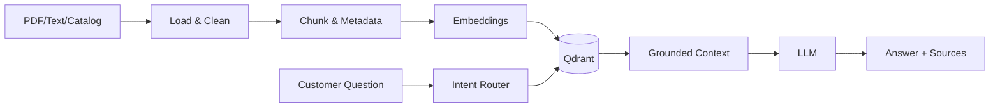

# Architecture

The online path separates intent routing, retrieval and generation. The offline path handles document normalization, chunking, embedding and Qdrant indexing. This separation lets ingestion scale independently from customer traffic.

